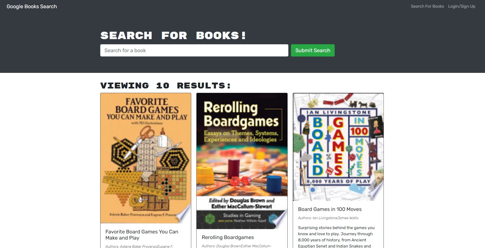

# Christinas-Nook
MERN Challenge

## Description

In Module 21, we were tasked with refactoring a Book Search Engine. This application has been developed using the MERN stack, incorporating a React front end, MongoDB database, Node.js, Express.js, and API. It was initially configured to enable users to save book searches on the back end

## Table of Contents

* [Deployed Application](#deployed-application)
* [Screenshot](#screenshot)
* [License](#license)
* [Questions](#Questions)
* [Github](#Github)

## Deployed Application
You can then navigate to [placeholder] in your browser to use the application.

## Screenshot:

## License
This project is licensed under the MIT license. Click [here](https://opensource.org/licenses/MIT) for more information. 

## Questions:
If you have any questions please email me at christina.e.c.barberi@gmail.com.

## Github:
Please visit my [GitHub](https://github.com/Christinaecb) to view my other work.

